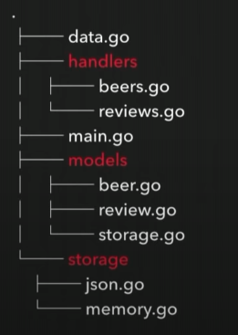

# Coding Conventions and Guidelines

---

## Intro
Coding standards are a series of procedures for a particular programming language specifying a programming style, the methods, and different procedures.
A coding standard makes sure that all the developers working on the project are following certain specified guidelines. The code can be easily understood and proper consistency is maintained.
> **The finished program code should look like that it has been written by a single developer, in a single session.**

### In general, best practices of better code: (**IMPORTANT!**)
- Code comments and proper documentation </br>
  It is advisable to start every method or routine with the comment specifying what a routine, method or a function does, about its various parameters, its return values, errors and exceptions (if any).
- Use indentation </br>
  There is no particular style to be followed in general. We can make our own style, but make sure that we follow this style consistently.
- Avoid commenting on obvious things. </br>
  Comments are good, but too much of them will lead us to chaos. We should avoid write comments on obvious things, or if our code is self-explained then no need to add comments.
- Grouping code </br>
  Remember that high cohesion code is good. Small and simple code is easy to manage and considered to be better.
- Proper and consistent scheme for naming </br>
  Choose one naming scheme and stick with it for the rest of the project.
- Principles of DRY </br>
  The good practice is to write our own code and don't copy-paste too frequently.
- Avoid deep nesting structure </br>
  Complex logic can be considered as lack of clarity and hard to understand.
- Use short line length </br>
  This makes sure our code easy and comfortable to read.
- Proper organizations of files and folders.
- Refactoring code </br>
  We have to implement the Open/Close Principle which basically states our code is closed for modification but open for extension.
  
---

## Project Structure

There are several goals we should achieve when structuring our project:
- Consistent
- Easy to understand, navigate, reason about (**make sense**)
- Easy to change
- Loosely coupled
- Easy to test
- As simple as possible, but no simplistic
- Design reflects exactly how the software works
- Structure reflects the design exactly

Then, the (kinda) best way to structure our project is by following Group by functions (layered architecure).
This project structure pattern is suitable for medium to large applications without having to overkill and use more complex structure.

We divide each package into its own functionalities, e.g. `package handlers` is responsible for HTTP handler for all endpoints.

### How to implement the Structure: (**IMPORTANT!**)

The list of packages (which means they have their own folders)
- handlers </br>
  We put all HTTP handler methods inside this folder. Then divide it into its own file. For example, all handlers for `vessels` functionality have to be put in this file which means we have to create `vessels.go` file.
  The main task of `handlers` is to parse the data for further processing and tidy up the response, so it will be readable for the user.
- usecases </br>
  All business logic implementations go here. Which means, this is the package where the data from user is processed.
  This package might include processing step before the data goes to the database or aggregate the queried data or combine several functionalities into one bucket.
  The bottom line is we have to put the business logic here and nowhere else.
- repositories </br>
  This package serves as the layer where our application makes contact with the database.
  Its main task is only database related functionalities, such as querying, inserting, updating, and deleting.
  Don't put excessive logic in here (e.g., control flow or conditional statements).
  If it is related to the database, like error handling for database querying, then it is fine.
- models </br>
  Any data entities or blueprints are belong in here. For example, if we have user data, then we have to make its blueprint as `struct` (with optional tags).
  We are also allowed to write helper methods, related to the entity. (e.g., if user need to be validated then it makes sense if the struct has method Validate() or IsValid())
- utilities </br>
  Any additional helpers are stored in this package.
- docs </br>
  For documentations (obviously).
  
If we need new packages to comprehend the growing complexity of our codebase, then feel free to add new one.
This structure should make our life easy, not giving us another headaches.

This is how our project structure would look like: </br>


---

## Naming Conventions

### 1. Folder name
- Use plural noun to name a directory or folder, if this folder contains several files **with the same functionalities**.
  (e.g. handlers, usecases, repositories since these folders contain their own funcionalities)
- Use singluar noun to name a directory or folder, if this folder contains several files **with the name describes how the files are grouped beyond their type**.
  (e.g. folder post contain sample data, functions, tupes and etc)
  
### 2. Package name
- Lowercase only </br>
  Package names should be lowercase. Don’t use snake_case or camelCase in package names.
- Short, but representative names </br>
  Package names should be short, but should be unique and representative. Users of the package should be able to grasp its purpose from just the package’s name.
- Singular
  We should not use plural noun for the name of a package
- Avoid generic names </br>
  Avoid using package names of util, misc, common since these names could not explain what they contain in a decent way.
  
Example:
```go
package http_utils // BAD
package httpUtils // BAD
package httputils // BAD
package httputil // GOOD
```

### 3. File name
- Go follows a convention where source files are all lower case with underscore separating multiple words.
- Compound file names are separated with _
- File names that begin with “.” or “_” are ignored by the go tool
- Files with the suffix _test.go are only compiled and run by the go test tool.

### 4. Variables
- Common variable/type combinations may use really short names </br>
  Prefer i to index. </br>
  Prefer r to reader. </br>
  Prefer b to buffer. </br>
  ```go
    for i, v := range lists {
        ...
    }
  ```

- Avoid using global variables, it's better to create global Getter and Setter </br>
  - Bad practice:
  ```go
    // Inside database.go
    ...
  
    var DB *sql.DB
  
    ... (some mutation to variable DB)
  
  ```
  - Better way
  ```go
    var db *sql.DB  

    // Better way (with local db variable)
    func GetDB() *sql.DB {
        return db
    }
  ```

### 5. Functions
- Use MixedCase(CamelCase)
- If we don't need to expose this function to other packages, then keep it local.


### 6. Parameters
- If the type could explain what it is, then use short name
```go
func UpdateUser(u *models.User) error {...}
```
- If the type could not explain what it is, then use descriptive name
```go
func Sleep(duration time.Time) error {...}
```
- The key point is use short and descriptive name

### 7. Receivers
- By convention, they are one or two characters that reflect the receiver type,
because they typically appear on almost every line </br>
```go
func (b *Buffer) Read(p []byte) (n int, err error)
```
- Keep the receiver name short, since the type of the receiver is oftenly could explain itself.

### 8. Return values
Return values on exported functions should only be named for documentation purposes.
```go
func Copy(dst Writer, src Reader) (written int64, err error)

func ScanBytes(data []byte, atEOF bool) (advance int, token []byte, err error)
```

### 9. Exported package-level names
Don't use stutter naming such as strings.StringReader. That's why we have bytes.Buffer and strings.Reader,
not bytes.ByteBuffer and strings.StringReader.

### 10. Interface Types

Interfaces that specify just one method are usually just that function name with 'er' appended to it.
```go
type Reader interface {
    Read(p []byte) (n int, err error)
}
```

### 10.  Errors
Error types should be of the form FooError:
```go
type ExitError struct {
...
}
```
Error values should be of the form ErrFoo:
```go
var ErrFormat = errors.New("image: unknown format")
```

More about errors on later section

### 11. Constants
Constant should use all capital letters and use underscore _ to separate words.

---

## Error Handling


---

## References:
### 1. Coding standards
  - https://www.multidots.com/importance-of-code-quality-and-coding-standard-in-software-development/#:~:text=Coding%20standards%20help%20in%20the,and%20thereby%20reduce%20the%20errors.&text=If%20the%20coding%20standards%20are%20followed%2C%20the%20code%20is%20consistent,at%20any%20point%20in%20time.
  - https://medium.com/leafgrowio-engineering/why-is-coding-standards-important-319fce79d1a4
### 2. Project structure in go
  - https://www.youtube.com/watch?v=oL6JBUk6tj0
  - https://tutorialedge.net/golang/go-project-structure-best-practices/
  - https://www.wolfe.id.au/2020/03/10/how-do-i-structure-my-go-project/
### 3. Naming Conventions
  - https://betterprogramming.pub/naming-conventions-in-go-short-but-descriptive-1fa7c6d2f32a
  - https://talks.golang.org/2014/names.slide#19
  - https://medium.com/@kdnotes/golang-naming-rules-and-conventions-8efeecd23b68
  - https://blog.golang.org/package-names
  - https://rakyll.org/style-packages/
  - https://logansbailey.com/plural-vs-singular-directory-names#:~:text=Directory%20names%20should%20be%20singular,and%20performing%20actions%20on%20them.