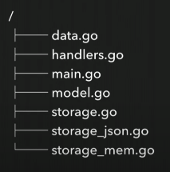
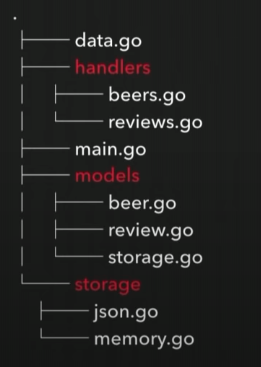
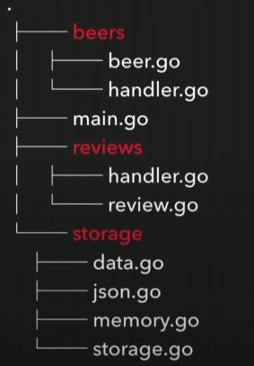
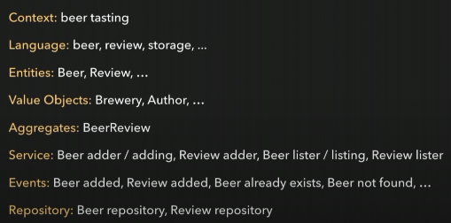
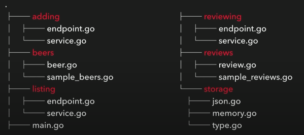
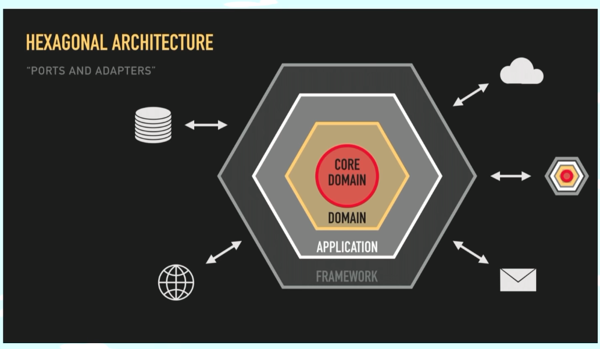
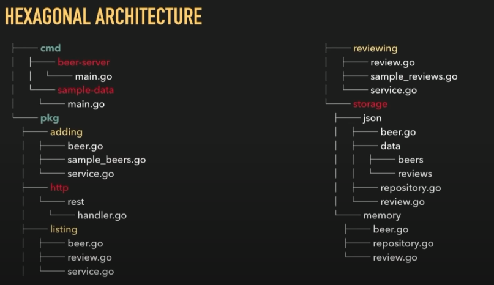
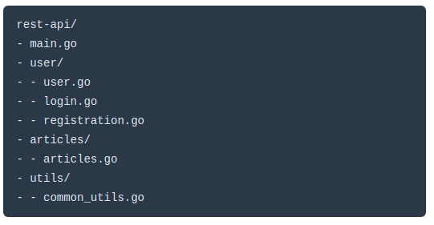

# Project Structure in Go

</br>

## List of Contents:
### 1. [GopherCon 2018: Kat Zien - How Do You Structure Your Go Apps](#content-1)
### 2. [Go Project Structure Best Practices](#content-2)
### 3. [How do I Structure my Go Project?](#content-3)
### 4. [Structuring Applications in Go](#content-4)
### 5. [Clean Architecture in Go](#content-5)

</br>

---

## Contents:

### [GopherCon 2018: Kat Zien - How Do You Structure Your Go Apps](https://www.youtube.com/watch?v=oL6JBUk6tj0) <span id="content-1"></span>

Good Structure Goals:
- Consistent
- Easy to understand, navigate, reason about (**make sense**)
- Easy to change
- Loosely coupled
- Easy to test
- As simple as possible, but no simplistic
- Design reflects exactly how the software works
- Structure reflects the design exactly

> Good code structure will make our life easier as a programmer

#### Flat Structure


If our app is simple, start with flat structure. But everything is global, this is certainly a drawback.

#### Group by function (layered architecture)

- Presentation/User interface
- Business logic
- External dependencies/infrastructures

Cons:
- We will easily be trapped in circular imports



#### Group by module



Cons:
- Funny naming
- Naming clash

#### Group by context (Domain Driven Development)

- Establish domain and business logic
- Define bounded contexts, limit our code into its own context
- Categorising the building blocks









This is probably an overkill for small app
> Don't start with a complex structure!

#### Testing
- Keep the _test.go files next to the main files
- Use a shared mock subpackage

#### Naming
- Choose package name to communicate what it provides rather than to what it contains
- Avoid generic names like util
- Follow the usual go convections
- Avoid stutter (e.g strings.Reader not strings.StringReader)

#### What is in the main file
keep main file short, it should only do one thing (e.g running the server)


</br>

---

### [Go Project Structure Best Practices](https://tutorialedge.net/golang/go-project-structure-best-practices/) <span id="content-2"></span>

Some people in Go community follow the well known [golang-standards/project-layout](https://github.com/golang-standards/project-layout). But after the introduction of go modules, this pattern starts to present challenges. 

#### Small Applications (Flat Structure)
Small applications are better to use flat structure, no need to overkill the structure by going complex at the start.
This structure has pros of simplicity. Developers don't have to think too hard to put which file on which folder.
They just have to focus on create the app itself and deliver its funcionalities.

Benefits:
- Suitable for microservices
- Suitable for small tools and libraries

#### Medium/Large Size Applications - Modularization



</br>

---

### [How do I Structure my Go Project?](https://www.wolfe.id.au/2020/03/10/how-do-i-structure-my-go-project/) <span id="content-3"></span>

This pattern usually used for big project when there are several main.go files with its own binary.

- /cmd </br>
  Contains the main application entry point files
- /internal </br>
  Holds the private library code used in the service
- /pkg
  Contains code which is OK for other services to consume, this may include API clients, or utility functions which may be handy for other projects
  
Goals we should consider:
- Keep things consistent
- Kepp things as simple as possible, but no simpler
- Loosely coupled sections of the service or application
- Aim to ensure it is easy to navigate our way around

</br>

---

## [Structuring Applications in Go](https://medium.com/@benbjohnson/structuring-applications-in-go-3b04be4ff091) <span id="content-4"></span>
- Don't use global variables
- You may decide to add a global database connection or a global configuration variable but these globals are a nightmare to use when writing unit tests
- Snippet
```go
type HelloHandler struct {
    db *sql.DB
}
func (h *HelloHandler) ServeHTTP(w http.ResponseWriter, r *http.Request) {
    var name string
    // Execute the query.
    row := h.db.QueryRow(“SELECT myname FROM mytable”)
    if err := row.Scan(&name); err != nil {
        http.Error(w, err.Error(), 500)
        return
    }
    // Write it back to the client.
    fmt.Fprintf(w, “hi %s!\n”, name)
}
```
- This is how to use wrapper https://gist.github.com/tsenart/5fc18c659814c078378d
```go
func helloHandler(db *sql.DB) http.Handler {
	return http.HandlerFunc(func(w http.ResponseWriter, r *http.Request) {
    		var name string
    		// Execute the query.
    		row := db.QueryRow("SELECT myname FROM mytable")
    		if err := row.Scan(&name); err != nil {
        		http.Error(w, err.Error(), 500)
        		return
    		}
    		// Write it back to the client.
    		fmt.Fprintf(w, "hi %s!\n", name)
    	})
}

func withMetrics(l *log.Logger, next http.Handler) http.Handler {
	return http.HandlerFunc(func(w http.ResponseWriter, r *http.Request) {
		began := time.Now()
		next.ServeHTTP(w, r)
		l.Printf("%s %s took %s", r.Method, r.URL, time.Since(began))
	})
}
```
- Separate your binary from your application
- Library driven development
- Wrap types for application-specific context
```go
package myapp
import (
    "database/sql"
)
type DB struct {
    *sql.DB
}
type Tx struct {
    *sql.Tx
}
```
```go
// Open returns a DB reference for a data source.
func Open(dataSourceName string) (*DB, error) {
    db, err := sql.Open("postgres", dataSourceName)
    if err != nil {
        return nil, err
    }
    return &DB{db}, nil
}
// Begin starts an returns a new transaction.
func (db *DB) Begin() (*Tx, error) {
    tx, err := db.DB.Begin()
    if err != nil {
        return nil, err
    }
    return &Tx{tx}, nil
}
```
- Don’t go crazy with subpackages
- Using a single root package
- Organize the most important type at the top of the file and add types in decreasing importance towards the bottom of the file.
- If you’re writing Go projects the same way you write Ruby, Java, or Node.js projects then you’re probably going to be fighting with the language.

</br>

---


## [Clean Architecture in Go](https://rubinthomasdev.medium.com/clean-architecture-in-go-e811f233cc04) <span id="content-3"></span>


### Clean Architecture.
- Diagram:
  
- Separation of Concerns. That is to isolate one layer of code from another layer in such a way that changes in one layer do not affect the other layer.
- A simplified diagram of the clean architecture above, shows the control flow. The code control moves from outer layers of external framework (eg. DB, HTTP etc) to the inner layers of controllers.
- The controllers in turn call the underlying Use Cases where the application specific business rules are coded.
-  Lastly the flow reaches the domain entities where the Enterprise Wide Business rules are coded.
-  The important thing to notice here is the central position the domain entities occupies. Since Domain Entities, and the Use cases, are the innermost layers containing the actual business rules, it should not be affected by the changes to the outermost layers.
-  For example, moving to a new Database or UI changes. In plain and simple terms, the inner layers cannot have reference or depend upon outer layers.


### Hexagonal Architecture
- Diagram:
  
- As can be seen from the diagram above, the isolation of Domain (Use Cases and Entities) is achieved through Dependency Inversion.
- The dependency inversion happens at the input and output ports as shown above. The ports are interfaces with functionalities defined. Use Cases (Service Layer) implement the input ports. The controller actually talks to the input port and has no idea on the service layer and the use case that implements it.


### TDD and Domain
- Since the Domain code is isolated from external frameworks and layers, we can and should cover the code in this layer with Unit Tests and achieve a high-code coverage.
- Unit test:
  ```go
  package domain

  import "testing"

  func TestGetTotalSalary(t *testing.T) {
  	testCases := []struct {
  		employee Employee
  		expected Money
  	}{
  		{
  			Employee{EmployeeID: EmployeeID{1}, Name: EmployeeName{"john", "doe"}, BaseSalary: Money{10.0}, Bonus: Money{1.2}},
  			Money{11.2},
  		},
  	}

  	for _, tc := range testCases {
  		want := tc.expected
  		got := tc.employee.CalculateTotalSalary()

  		if want != got {
  			t.Errorf("Employee get total Salary failed. Wanted %.1f, Got %.1f", want.Amount, got.Amount)
  		}
  	}
  }
  ```
- Domain:
  ```go
  package domain

  type Employee struct {
  	EmployeeID EmployeeID   `json:"employeeID"`
  	Name       EmployeeName `json:"employeeName"`
  	BaseSalary Money        `json:"baseSalary"`
  	Bonus      Money        `json:"bonus"`
  }

  func (e Employee) CalculateTotalSalary() Money {
  	return e.BaseSalary.Add(e.Bonus)
  }
  ```

### TDD and Application
- Sample test:
  ```go
  func TestGetEmployeeDetails(t *testing.T) {
  	inputID := in.EmployeeQueryID{ID: 1}
  	service := GetEmployeeDetailsService{LoadEmployeeDataPort: MockLoadEmployeeDataPort{}}

  	want := MockLoadEmployeeDataPort{}.GetEmployeeDataFromPersistence(domain.EmployeeID(inputID))

  	got := service.GetEmployeeDetails(inputID)

  	if !reflect.DeepEqual(want, got) {
  		t.Errorf("Get Employee Details failed. Wanted : %v, Got %v", want, got)
  	}
  }
  ```
- Application:
  ```go
  package service

  import (
  	"github.com/rubinthomasdev/go-employee/employee/application/port/in"
  	"github.com/rubinthomasdev/go-employee/employee/application/port/out"
  	"github.com/rubinthomasdev/go-employee/employee/domain"
  )

  type GetEmployeeDetailsService struct {
  	LoadEmployeeDataPort out.LoadEmployeeDataPort
  }

  func (g GetEmployeeDetailsService) GetEmployeeDetails(inputID in.EmployeeQueryID) domain.Employee {
  	return g.LoadEmployeeDataPort.GetEmployeeDataFromPersistence(domain.EmployeeID{ID: inputID.ID})
  }

  func (g GetEmployeeDetailsService) GetAllEmployees() []domain.Employee {
  	return g.LoadEmployeeDataPort.GetAllEmployees()
  }
  ```
- Interface:
  ```go
  package in

  import "github.com/rubinthomasdev/go-employee/employee/domain"

  type GetEmployeeDetailsQuery interface {
  	GetEmployeeDetails(id EmployeeQueryID) domain.Employee
  	GetAllEmployees() []domain.Employee
  }
  ```


### Integration Tests and Adapters
- Adapters are of two kinds : Driver Adapters (Trigger Flow Control into the inner Domain layer)and Driven Adapters (These are triggered by, usually by the inner layers).
- For example, in case of web controllers we might want to test if the underlying service is indeed getting triggered and a proper response is being sent.
- Similarly, in case of DB, we want to actually hit the DB and see if the interactions are working. I have used docker compose to start a postgres container for PersistenceAdapter Integration testing.


### Wire it all up
- Example:
  ```go
  package main

  import (
  	"log"
  	"net/http"

  	"github.com/rubinthomasdev/go-employee/employee/adapter/in/web"
  	inmemdb "github.com/rubinthomasdev/go-employee/employee/adapter/out/db/inMemDB"
  	"github.com/rubinthomasdev/go-employee/employee/adapter/out/persistence"
  	"github.com/rubinthomasdev/go-employee/employee/application/service"
  )

  func main() {

  	// create DB
  	inMemDB := inmemdb.InMemDB{}

  	// create repo
  	getEmpRepo := inmemdb.InMemRepository{Db: &inMemDB}
  	getEmpRepo.Initialize()

  	// create adapter
  	getEmpAdapter := persistence.EmployeePersistenceAdapter{EmployeeRepo: getEmpRepo, Mapper: persistence.EmployeeDataMapper{}}

  	// create service
  	getEmpSvc := service.GetEmployeeDetailsService{LoadEmployeeDataPort: getEmpAdapter}

  	// create handler
  	getEmpHandler := web.GetEmployeeDataHandler{GetEmployeeDataUseCase: getEmpSvc}

  	//http handler registration
  	http.HandleFunc("/api/v1/employees/", getEmpHandler.GetEmployeeDetails)

  	//start the server
  	log.Fatal(http.ListenAndServe(":8080", nil))
  }
  ```


</br>

---

## References
- https://www.youtube.com/watch?v=oL6JBUk6tj0
- https://tutorialedge.net/golang/go-project-structure-best-practices/
- https://www.wolfe.id.au/2020/03/10/how-do-i-structure-my-go-project/
- https://medium.com/@benbjohnson/structuring-applications-in-go-3b04be4ff091
- https://levelup.gitconnected.com/a-practical-approach-to-structuring-go-applications-7f77d7f9c189 (UNREAD)
- https://rubinthomasdev.medium.com/clean-architecture-in-go-e811f233cc04